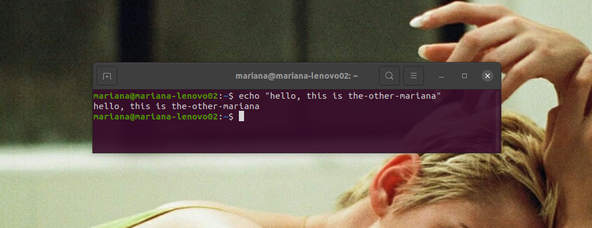

## Welcome :wave:

Hi, I'm Mariana. I use GitHub to talk to myself and keep an order in the code I love.

My interests regarding Computer Science are:

- Computer Graphics
- Computational Geometry
- Simulation (Math & Stats)
- Parallelism/Concurrency in RESTful APIs
- Sensors, motors & microcontroller Boards

In my spare time I am a passionate fan of football :soccer: and Croatian language: sve će biti dobro :)  

### Follow Me

 
 

### Programming Languages & Tools

 
 

 
  Visitor count 
  

